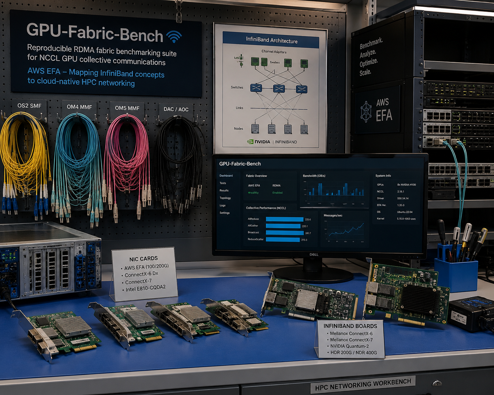
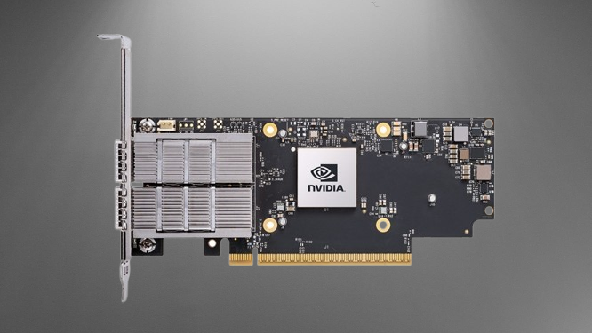
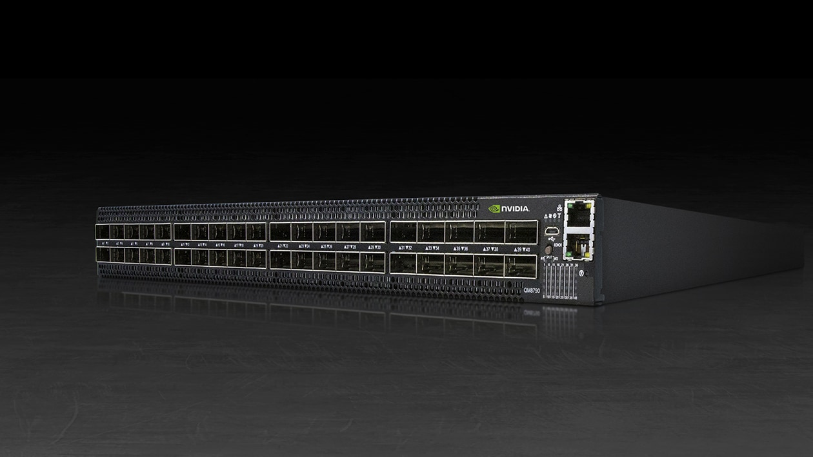
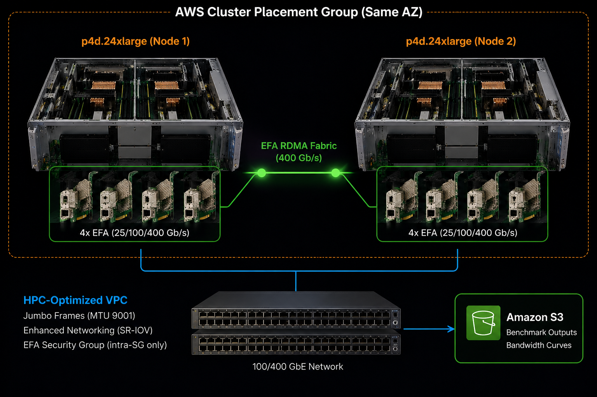

# GPU-Fabric-Bench 🛜

> Reproducible RDMA fabric benchmarking suite for NCCL GPU collective communications on AWS EFA mapping InfiniBand
> concepts to cloud-native HPC networking.




### 🎯 Goal

> Goal is to build NVIDIA GPU-GPU communication network(Not to be confused with AWS VPC) for distributed AI/HPC
> workloads

### Relationship to nvidia-superpod

These two projects complement each other cleanly:

| Project                                                                | What it shows                                                  |
|------------------------------------------------------------------------|----------------------------------------------------------------|
| [ 🐸 nvidia-superpod](https://github.com/hiteshsahu/Nvidia-Super-Pod)  | GPU cluster provisioning, Kubernetes, CUDA, Triton, Pytorch    |
| [🛜 gpu-fabric-bench ](https://github.com/hiteshsahu/GPU-Fabric-Bench) | Network fabric layer, RDMA, collective comms, HPC benchmarking |

---

## 📋 Hardware Reality Check First

<h2>
  
Networking Stack
</h2>

###   

### 1. 🔀 `RDMA` :: Remote Direct Memory Access

> Across servers Direct GPU memory access over network

- Memory access across hosts

### **GPUDirect RDMA**

> GPU to GPU across nodes → GPUDirect RDMA

- Works **across hosts**
- GPU-to-GPU or GPU-to-NIC
- data transfer for HPC, AI clusters
- No CPU involvement = Ultra-low latency

### ⛔ **Limitations**

- ⚠️ Needs specialized `RDMA-capable NICs` <br/><br/>

Example: [ConnectX NICs](https://resources.nvidia.com/en-us-accelerated-networking-resource-library/connectx-7-datasheet)

  

Technical deep dive of RDMA is in [doc/rdma-primer](./docs/rdma-primer.md)

### 2. 🪢 **InfiniBand**

> High throughput, low latency, low CPU overhead compute interconnect for HPC and AI clusters

- Managed by [Open Subnet Manager (SM)](https://docs.nvidia.com/networking/display/mlnxofedv461000/opensm).
- Ultra-low latency (1–2 µs)
- Uses `Native RDMA` Stack to access remote memory directly without CPU involvement
- `HCA` (Host Channel Adapter): allows hardware offload of RDMA operations
- Used in large HPC / AI clusters: over 50% HPC clusters use InfiniBand

### ⛔ **Limitations**

- ⚠️ Need physical Mellanox/NVIDIA NICs (~$500–2000) + IB switch.

- [NVIDIA Quantum-X 800](https://www.nvidia.com/en-us/networking/products/infiniband/quantum-x800/) Infiniband switch
  for high-performance InfiniBand-based AI<br/><br/>

  

### 3. 🔌 `RoCE`:: RDMA over Converged Ethernet

> RDMA + Ethernet: Enables `RDMA` over Ethernet

- Standards-based (IBTA) alternative to InfiniBand over Ethernet
- More flexible than infiniBand
- Cheaper Enterprise-friendly
- Used in enterprise AI clusters

### ⛔ **Limitations**

- ⚠️ Need RDMA-capable NICs `RoCE` works on standard 25GbE+

---

<h2>
  
  AWS Networking Stack
</h2>

### ⚡  `EFA` :: **Elastic Fabric Adapter**

> `EFA` (Elastic Fabric Adapter) = AWS's RDMA-like network interface

Uses a proprietary **SRD (Scalable Reliable
Datagram)** transport not RoCE v2 or standard IB.

### **Nvidia Equivalent**

Detailed comparison of ib & aws efa is in [doc/Ib-vs-efa](./docs/Ib-vs-efa.md)

- ☑️  `InfiniBand` → EFA: same kernel-bypass + RDMA semantics, different transport (SRD vs RC/UD)
- ☑️  `HCA / libibverbs` → EFA NIC + libfabric with EFA provider
- ☑️  `NCCL over IB` → NCCL over EFA via `aws-ofi-nccl` plugin

### **Verdict**

> AWS EFA can provide the setup needed for building HPC cluster network

- Supports Nvidia NCCL/MPI stack without custom hardware
- Can be Provision with `Terraform` IaC and tear down when not needed
- **Low capx:** No need to buy expensive NVIDIA pieces of hardware

---

## 🏗️ Architecture

An $N$ GPU nodes connected HPC cluster performing distributed load can be created with EFA.

Depending on Type of EC2 used we can experiment with different network boards



This gives a flexibility of trying different NCCL topologies with opportunity to run Benchmarks.

Benchmark results can be stored in `S3` and then a Python script can be used to visualize test results.




---

## ▶️ Development

```bash

# 1. Provision infrastructure
cd terraform/environments/dev
terraform init && terraform apply

# 2. Configure nodes
cd ../../../ansible
ansible-playbook -i inventory/hosts.ini site.yml

# 3. Run benchmarks
cd ../benchmarks/nccl
./run_allreduce.sh

# 4. Analyze results
cd ../../analysis
python parse_results.py ../benchmarks/nccl/results/
python plot_bandwidth.py

```

## 📁 Folder Structure

```text
    
    gpu-fabric-bench/
    ├── terraform/
    │   ├── efa-cluster/        # p4d instances + placement group + EFA
    │   ├── vpc-hpc/            # HPC-optimized VPC (jumbo frames, enhanced networking)
    │   └── s3-results/         # benchmark result storage
    ├── ansible/
    │   ├── roles/
    │   │   ├── efa-setup/      # EFA driver install, ibverbs, libfabric
    │   │   ├── nccl-install/   # NCCL + nccl-tests
    │   │   ├── openmpi/        # MPI for multi-node orchestration
    │   │   └── osu-benchmarks/ # OSU MPI micro-benchmarks
    ├── benchmarks/
    │   ├── nccl/
    │   │   ├── run_allreduce.sh
    │   │   ├── run_allgather.sh
    │   │   └── sweep_msgsize.sh   # sweep 1KB → 1GB message sizes
    │   └── mpi/
    │       ├── osu_latency.sh
    │       └── osu_bandwidth.sh
    ├── analysis/
    │   ├── parse_results.py    # parse nccl-tests output
    │   ├── plot_bandwidth.py   # matplotlib bandwidth curves
    │   └── compare_baseline.py # vs theoretical peak
    ├── docs/
    │   ├── ib-vs-efa.md        # InfiniBand concepts mapped to EFA
    │   ├── rdma-primer.md      # RDMA verbs, RC/UC/UD transport
    │   └── results/            # sample benchmark outputs + graphs
    └── README.md
    
```

---

## ⏱️ Benchmark

> See [benchmarks/README.md](benchmarks/README.md) for full run instructions, pass criteria, and tuning guide.

### 🔗 Two suites

| Suite | Script | Instance | What it tests |
|-------|--------|----------|---------------|
| **MPI / OSU** | `benchmarks/mpi/osu_latency_bw.sh` | `c5n.18xlarge` | EFA fabric: point-to-point latency + bandwidth |
| **NCCL** | `benchmarks/nccl/run_allreduce.sh` | `p4d.24xlarge` | GPU collective: AllReduce 1K → 4G message sweep |

Run MPI first — it validates the fabric cheaply before spending GPU time on NCCL.

### Key Results (sample) — NCCL AllReduce, 2× p4d.24xlarge (16 GPUs)

```
#       size         count    time(us)  algbw(GB/s)  busbw(GB/s)  #wrong
    16777216       4194304      892.1        18.81        35.27       0
   536870912     134217728    18432.0        29.13        54.62       0
  4294967296    1073741824   143891.2        29.85        55.97       0
# Avg bus bandwidth : 31.42 GB/s
```

`busbw` plateauing at ~55 GB/s = ~90% of 400 Gb/s EFA — healthy result.

---

## 💰 Cost Consideration

> Recommended: Prototype on c5n, run GPU benchmark once, capture results, terminate.

| Instance          | Use case                 | Cost      |
|-------------------|--------------------------|-----------|
| `c5n.18xlarge` x2 | EFA + MPI + OSU (no GPU) | ~$7.76/hr |
| `p4d.24xlarge` x2 | Full NCCL GPU benchmarks | ~$64/hr   |

### 1. Amazon EC2 UltraClusters 🏎️

> Production grade Nvidia Super Computer

- `p4d.24xlarge` = ~$32/hr.(Full GPU benchmark 2–4 hrs of actual runtime)
- NVIDIA A100 Tensor Core GPUs
- Estimated total cost: ~$30–50 for benchmark run with real results.

| Instance      | GPUs     | GPU Memory         | CPU      | RAM      | Network          | RDMA | GPU Interconnect  |
|---------------|----------|--------------------|----------|----------|------------------|------|-------------------|
| p4d.24xlarge  | 8 × A100 | 320 GB total HBM2  | 96 vCPUs | 1152 GiB | 400 Gbps EFA/ENA | Yes  | 600 GB/s NVSwitch |
| p4de.24xlarge | 8 × A100 | 640 GB total HBM2e | 96 vCPUs | 1152 GiB | 400 Gbps EFA/ENA | Yes  | 600 GB/s NVSwitch |

### 2. AWS C5n Compute Instances 🚗

> Cost-effective EFA testing without GPU spend

- `c5n.18xlarge` = ~$3.88/hr
- Intel Xeon (Cascade Lake) processors
- EFA-enabled, CPU only: lets you test EFA + MPI + OSU benchmarks without GPU cost

| Instance     | vCPUs | Memory (GiB) | Network  | EBS Bandwidth |
|--------------|-------|--------------|----------|---------------|
| c5n.18xlarge | 72    | 192          | 100 Gbps | 19 Gbps       |
| c5n.9xlarge  | 36    | 96           | 50 Gbps  | 9.5 Gbps      |

---

## 📒 Docs

- [InfiniBand vs EFA Deep Dive](./docs/Ib-vs-efa.md)
- [RDMA Primer](docs/rdma-primer.md)
- [NCCL Tuning Guide](docs/nccl-tuning.md)
- [Benchmark Results](docs/results/)
