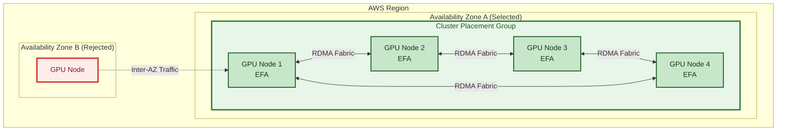
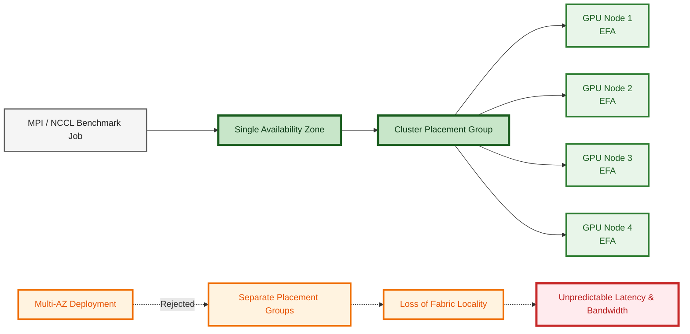

## ADR-1: Deploy all cluster nodes in a single Availability Zone

**Status:** Accepted  
**Date:** 2026-06-16  
**Context:** Terraform EFA cluster module (`terraform/modules/efa-cluster`)

---

## ℹ️ Context

The benchmark cluster uses an AWS cluster placement group to minimize fabric latency between nodes.

EFA (Elastic Fabric Adapter) RDMA traffic must travel over the intra-cluster fabric to achieve the target bandwidth (~400 Gb/s aggregate) and latency (~15–25 µs MPI).

## 📜 Decision

> All cluster nodes are deployed into a **single Availability Zone** subnet. 

The VPC module creates one private subnet pinned to a specific AZ, and all instances in the efa-cluster module use that subnet.

## 💡 Reasons

### 1. **Cluster placement groups are limited to a single AZ.** 
> AWS cluster placement groups do not span Availability Zones. 

Because low-latency collective communication depends on cluster placement locality, all benchmark nodes must be deployed within one AZ.



### 2. **Inter-AZ traffic bypasses the EFA fabric.**
> Traffic between nodes in different AZs routes through the AWS backbone network, not the EFA fabric. 

EFA-enabled MPI and NCCL workloads achieve the best latency and bandwidth when instances are co-located within a cluster placement group.

Deploying nodes across Availability Zones removes these locality guarantees and degrades collective communication performance.
 - adds ~500 µs of latency (vs ~15–25 µs on EFA) 
 - removes RDMA effectively degrading to TCP-over-Ethernet performance.




### 3. **EFA security group validation is local.** 
> EFA enforces that both endpoints of an RDMA connection belong to the same security group *and* are reachable within the cluster fabric.

Cross-AZ connections fail this check even if the SG is shared.

---
## ⚠️ Consequences

### AZ Bound
The caller must choose an AZ where the target instance type has capacity.

- Check before applying `p4d.24xlarge` capacity in specific AZ: 

  ```bash
  
  aws ec2 describe-instance-type-offerings \
    --location-type availability-zone \
    --filters Name=instance-type,Values=p4d.24xlarge \
    --region us-east-1 \
    --query 'InstanceTypeOfferings[].Location'
  
  ```

- `availability_zone` is a required variable in both `vpc-hpc` and `environments/dev`.

  
### Failure recovery
**Multi-AZ redundancy is not a goal for this benchmarking workload.** 
>If a node fails, the benchmark run is re-started, not failed over.

### Future Consideration:
If capacity shortages become frequent, evaluate Capacity Reservations
or Capacity Blocks for GPU instances within the selected AZ.

---

## Rejected alternatives

| Alternative                                    | Why rejected                                                                                                              |
|------------------------------------------------|---------------------------------------------------------------------------------------------------------------------------|
| Multi-AZ with separate placement groups per AZ | Benchmark jobs span all nodes; a job cannot split cleanly across two placement groups without breaking the AllReduce ring |
| No placement group (AZ-flexible)               | Removes the fabric locality guarantee; nodes may end up on different spines with unpredictable latency and bandwidth      |
