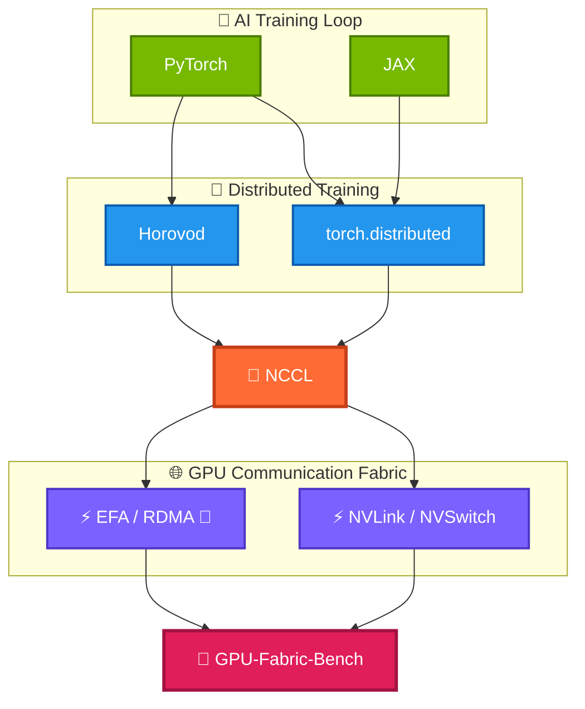
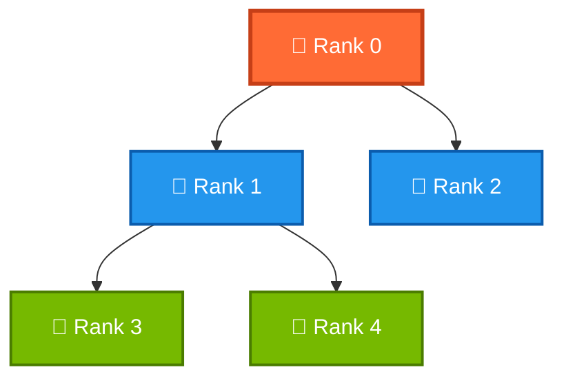

## NCCL Tuning Guide — Collectives, Algorithms, and EFA

> Covers NCCL internals, algorithm selection, environment variable tuning, and EFA-specific configuration.

---

## 🧠 What Is NCCL?

**NCCL (NVIDIA Collective Communications Library)** is NVIDIA's high-performance library for GPU collective operations
used in distributed deep learning.




**What NCCL does automatically:**

- Detects GPU topology (NVLink, PCIe, RDMA)
- Selects ring or tree algorithm based on message size and node count
- Routes traffic over the fastest available path (NVSwitch > NVLink > PCIe > RDMA)
- Handles chunking, pipelining, and retransmit on RDMA transport

---

## 🔀 Collective Operations

| Operation         | What it does                                                | Shape   | LLM use case               |
|-------------------|-------------------------------------------------------------|---------|----------------------------|
| **AllReduce**     | Sum (or avg) tensors across all ranks, result on every rank | N → N   | Gradient sync              |
| **AllGather**     | Each rank contributes a shard; all ranks get full tensor    | N/P → N | ZeRO-3 param gather        |
| **ReduceScatter** | Sum across ranks, each rank keeps its shard                 | N → N/P | ZeRO-3 gradient scatter    |
| **Broadcast**     | Root sends tensor to all ranks                              | 1 → N   | Param init                 |
| **AlltoAll**      | Each rank sends a unique chunk to every other rank          | N → N   | Mixture-of-Experts routing |
| **Send/Recv**     | Point-to-point between two specific ranks                   | 1 → 1   | Pipeline parallelism       |

---

## ⚙️ Algorithm Selection — Ring vs Tree

NCCL automatically picks an algorithm based on message size and topology. Understanding this lets you override when NCCL
gets it wrong.

### 🔄 Ring AllReduce


Best for: **large messages** (≥ 1 MB) where bandwidth matters more than latency.

| Metric                | Value                                |
|-----------------------|--------------------------------------|
| Communication Steps   | $2(N-1)$                             |
| Latency               | $O(N)$                               |
| Bandwidth Utilization | Excellent                            |
| Best For              | Large messages                       |
| Weakness              | Higher latency as cluster size grows |

- **Bus bandwidth saturated**:  $2(N-1)$ always uses 100% of bisection bandwidth
- **Latency**: $O(N)$  — poor for small messages at large scale

### 🌲 Tree AllReduce (Binary/Recursive Halving)



| Metric                | Value                                 |
|-----------------------|---------------------------------------|
| Communication Steps   | $2 \times \log_2(N)$                  |
| Latency               | $O(\log N)$                           |
| Bandwidth Utilization | Moderate                              |
| Best For              | Small messages, large clusters        |
| Weakness              | Internal nodes can become bottlenecks |


- **Latency:** $O(\log N)$ — much better than ring at scale
- **Bandwidth:** slightly worse than ring for large messages (tree has internal bottleneck)

Best for: **small messages** and **large GPU counts** where latency dominates.

### Override Algorithm

```bash

    # Force ring
    NCCL_ALGO=Ring
    
    # Force tree
    NCCL_ALGO=Tree
    
    # Let NCCL decide (default)
    NCCL_ALGO=auto
    
```

---

## 🛠️ Essential Environment Variables

### Transport

| Variable             | Default | What it does                                                           |
|----------------------|---------|------------------------------------------------------------------------|
| `NCCL_IB_DISABLE`    | `0`     | Set `1` to disable RDMA/IB transport entirely (falls back to TCP)      |
| `NCCL_IB_HCA`        | auto    | Specify which HCA to use: `mlx5_0`, `efa_0`, `^mlx5_2` (exclude)       |
| `NCCL_SOCKET_IFNAME` | auto    | Network interface for TCP fallback: `eth0`, `ens5`, `efa`              |
| `NCCL_NET_PLUGIN`    | none    | Load a NCCL net plugin: `aws-ofi-nccl` for EFA                         |
| `NCCL_P2P_DISABLE`   | `0`     | Set `1` to disable NVLink P2P (force PCIe path — useful for debugging) |
| `NCCL_SHM_DISABLE`   | `0`     | Set `1` to disable shared memory transport for intra-node              |

### Algorithm and Chunking

| Variable                      | Default   | What it does                                         |
|-------------------------------|-----------|------------------------------------------------------|
| `NCCL_ALGO`                   | auto      | `Ring`, `Tree`, or `CollNet`                         |
| `NCCL_PROTO`                  | auto      | `Simple`, `LL` (low-latency), `LL128`                |
| `NCCL_BUFFSIZE`               | `4194304` | NCCL internal buffer size per channel (4 MB default) |
| `NCCL_NCHANNELS_PER_NET_PEER` | auto      | Channels per RDMA link; raise for multi-rail NICs    |
| `NCCL_MIN_NCHANNELS`          | auto      | Minimum channels NCCL allocates                      |
| `NCCL_MAX_NCHANNELS`          | auto      | Cap channels (reduce for CPU-bound jobs)             |

### Performance

| Variable            | Default | What it does                                                   |
|---------------------|---------|----------------------------------------------------------------|
| `NCCL_IB_GID_INDEX` | `0`     | GID table index for RoCE v2 / IB — set `3` on some EFA configs |
| `NCCL_IB_TC`        | `0`     | Traffic class (DSCP) for QoS priority                          |
| `NCCL_IB_TIMEOUT`   | `14`    | RC QP timeout (exponential: value 14 ≈ 67ms)                   |
| `NCCL_IB_RETRY_CNT` | `7`     | RC retry count before error                                    |
| `NCCL_CROSS_NIC`    | `2`     | Allow cross-NIC traffic (`0`=off, `1`=on, `2`=auto)            |

### Debugging

| Variable               | Values                                  | What it does                                    |
|------------------------|-----------------------------------------|-------------------------------------------------|
| `NCCL_DEBUG`           | `VERSION`, `WARN`, `INFO`, `TRACE`      | Log verbosity; `INFO` shows transport selection |
| `NCCL_DEBUG_SUBSYS`    | `ALL`, `COLL`, `NET`, `GRAPH`, `TUNING` | Filter debug output to a subsystem              |
| `NCCL_DEBUG_FILE`      | `/tmp/nccl_%h_%p.log`                   | Write logs to file (`%h`=host, `%p`=pid)        |
| `NCCL_GRAPH_DUMP_FILE` | `/tmp/nccl_graph`                       | Dump the topology graph NCCL detected           |
| `NCCL_TOPO_DUMP_FILE`  | `/tmp/nccl_topo`                        | Dump physical topology XML                      |

---

##  ⚡ EFA-Specific Configuration

### Required Plugin

NCCL does not speak EFA natively. You need `aws-ofi-nccl`, which bridges NCCL's net plugin API to libfabric's EFA
provider.

```
NCCL → aws-ofi-nccl plugin → libfabric EFA provider → EFA NIC → SRD network
```

```bash
    
    # Install aws-ofi-nccl
    git clone https://github.com/aws/aws-ofi-nccl
    ./autogen.sh && ./configure --with-mpi=/opt/amazon/openmpi \
        --with-libfabric=/opt/amazon/efa \
        --with-nccl=/usr/local/nccl \
        --with-cuda=/usr/local/cuda
    make && sudo make install
    
    # Verify plugin is found
    ls /usr/local/lib/libnccl-net.so

```

### Recommended EFA Launch Environment

```bash
    
    # Tell NCCL to use EFA HCAs, not eth0
    export NCCL_IB_HCA=efa
    export NCCL_SOCKET_IFNAME=efa
    
    # Enable GPUDirect RDMA over EFA (p4d only)
    export FI_EFA_USE_DEVICE_RDMA=1
    
    # EFA fork safety (required for MPI + NCCL)
    export FI_EFA_FORK_SAFE=1
    
    # Point NCCL to the aws-ofi-nccl plugin
    export LD_LIBRARY_PATH=/usr/local/lib:$LD_LIBRARY_PATH
    
    # Debug — confirm EFA transport is selected
    export NCCL_DEBUG=INFO
    export NCCL_DEBUG_SUBSYS=NET

```

### EFA Multi-Rail (p4d has 4 EFA NICs)

```bash

    # Let NCCL use all 4 EFA NICs in parallel
    export NCCL_IB_HCA=efa0,efa1,efa2,efa3
    
    # Or let NCCL auto-detect all EFA devices
    export NCCL_IB_HCA=efa
    
    # Check how many channels NCCL allocated (look for "nChannels")
    NCCL_DEBUG=INFO mpirun ... 2>&1 | grep nChannels

```

---

## 🔄 NCCL Protocol Selection

NCCL has three internal protocols, auto-selected by message size:

| Protocol             | Latency | Bandwidth | Message size   | How it works                             |
|----------------------|---------|-----------|----------------|------------------------------------------|
| **LL** (Low Latency) | Lowest  | Low       | < 64 KB        | 128-bit flag+data, CPU polls completion  |
| **LL128**            | Low     | Medium    | 64 KB – 512 KB | 128-byte messages with inline flag       |
| **Simple**           | Higher  | Highest   | > 512 KB       | Full RDMA Write, GPU DMA, no CPU polling |

```bash

    # Force Simple protocol (best for large AllReduce in LLM training)
    NCCL_PROTO=Simple
    
    # Force LL (best for small control messages, tight loops)
    NCCL_PROTO=LL

```

---

## 🏎️ Tuning for LLM Training Workloads

### Large AllReduce (gradient sync, ≥ 100 MB)

```bash
    
    # Ring + Simple protocol = maximum bandwidth
    export NCCL_ALGO=Ring
    export NCCL_PROTO=Simple
    export NCCL_BUFFSIZE=8388608    # 8 MB buffer (2× default)
    export FI_EFA_USE_DEVICE_RDMA=1 # GPU → NIC direct DMA

```


### Small AllReduce (< 1 MB, many iterations)

```bash
    
    # Tree + LL = minimum latency
    export NCCL_ALGO=Tree
    export NCCL_PROTO=LL

```

### Pipeline Parallelism (Send/Recv heavy)

```bash
    
    # Ensure dedicated channels per peer, not shared
    export NCCL_NCHANNELS_PER_NET_PEER=2
    export NCCL_MIN_NCHANNELS=4

```

### NVLink vs RDMA Priority

```bash
    
    # Check NCCL's detected topology (look for NVLink / NET lines)
    NCCL_DEBUG=INFO NCCL_DEBUG_SUBSYS=GRAPH mpirun ... 2>&1 | grep -E "NVLink|NET|ring"
    
    # NCCL path priority (automatic):
    # 1. NVSwitch (intra-node, 600 GB/s on A100)
    # 2. NVLink (intra-node, direct peer link)
    # 3. PCIe (intra-node, ~64 GB/s)
    # 4. RDMA / EFA (inter-node)
    # 5. TCP socket (fallback)

```

---

## 📊 Benchmark — Reading nccl-tests Output

```bash
    
    # Run AllReduce sweep across message sizes
    all_reduce_perf \
      -b 1K -e 1G -f 2 \       # 1 KB → 1 GB, doubling each step
      --iters 20 \              # 20 iterations per size
      --warmup_iters 5          # 5 warmup iters before timing
      
```

```

    # Sample output
    #                                                              out-of-place                       in-place
    #       size         count      type   redop    root    time   algbw   busbw #wrong   time   algbw   busbw #wrong
    #        (B)    (elements)                               (us)  (GB/s)  (GB/s)          (us)  (GB/s)  (GB/s)
          1048576        262144     float     sum      -1    245.3    4.27    8.01      0    243.1    4.31    8.08      0
         16777216       4194304     float     sum      -1    892.1   18.81   35.27      0    889.4   18.87   35.38      0
        536870912     134217728     float     sum      -1  18432.0   29.13   54.62      0  18401.0   29.18   54.71      0

```

| Column         | Meaning                                                                      |
|----------------|------------------------------------------------------------------------------|
| `time (us)`    | Wall-clock latency for the collective                                        |
| `algbw (GB/s)` | Algorithmic bandwidth: `size / time`                                         |
| `busbw (GB/s)` | Bus bandwidth: `algbw × algorithm factor` — what the fabric actually carried |
| `#wrong`       | Data validation errors — must be `0`                                         |

**busbw formula for AllReduce (Ring):**  `algbw × 2(N-1)/N`  
For 2 nodes (N=2): factor = 1.0. For 16 nodes: factor = 1.875.

**Theoretical peak check:**

```bash
    
    # p4d EFA: 400 Gb/s = 50 GB/s per direction
    # NCCL busbw of ~45+ GB/s = ~90% fabric utilization (good)
    # busbw < 30 GB/s = investigate (wrong HCA, missing plugin, TCP fallback)

```

---

## 🔧 Debugging Playbook

### Step 1 — Confirm transport

```bash

    NCCL_DEBUG=INFO NCCL_DEBUG_SUBSYS=NET mpirun --np 2 --hostfile hosts \
      all_reduce_perf -b 1G -e 1G --iters 1 2>&1 | grep -E "Using|NET|transport"
    
    # Good (EFA):   NCCL INFO NET/OFI ... Using EFA provider
    # Bad (socket): NCCL INFO NET Using socket transport

```

### Step 2 — Confirm GPUDirect

```bash

    NCCL_DEBUG=INFO mpirun ... 2>&1 | grep -i "gdr\|gdrcopy\|device rdma"
    
    # Good: NCCL INFO Using device RDMA
    # Bad:  nothing → FI_EFA_USE_DEVICE_RDMA=1 not set or nv_peer_mem not loaded

```

### Step 3 — Check NIC affinity per GPU

```bash

    nvidia-smi topo -m
    # Ensure each GPU is closest to an EFA NIC (PIX or PXB, not SYS)
    # NCCL assigns channels to NICs based on this topology

```

### Step 4 — Isolate inter-node vs intra-node

```bash

    # Run only on 1 node (8 GPUs) → tests NVSwitch/NVLink path
    mpirun --np 8 all_reduce_perf -b 1G -e 1G --iters 10
    
    # Run on 2 nodes (16 GPUs) → adds EFA path
    mpirun --np 16 --hostfile 2node_hosts all_reduce_perf -b 1G -e 1G --iters 10
    
    # If 1-node is fast but 2-node is slow → EFA/RDMA issue
    # If both are slow → NVLink/topology issue

```

### Step 5 — Common fixes

| Symptom                    | Likely cause                        | Fix                                                     |
|----------------------------|-------------------------------------|---------------------------------------------------------|
| `busbw` << 30 GB/s on EFA  | Plugin not loaded, using TCP        | Check `LD_LIBRARY_PATH`, `NCCL_DEBUG=INFO` for "socket" |
| Hangs at init              | EFA security group missing          | Allow all traffic within placement group SG             |
| `#wrong` errors            | Memory corruption / GPUDirect issue | `unset FI_EFA_USE_DEVICE_RDMA`, test without GPUDirect  |
| High variance between runs | EFA SRD reordering                  | Add `NCCL_IB_TIMEOUT=22`, check for packet drops        |
| Slow for small messages    | Ring selected for small msg         | Set `NCCL_ALGO=Tree` and `NCCL_PROTO=LL`                |
| CUDA out of memory at init | Too many NCCL channels              | Set `NCCL_MAX_NCHANNELS=4`                              |

---

## 🗺️ NCCL on IB vs EFA — Side by Side

| Config                     | InfiniBand (on-prem)         | AWS EFA                           |
|----------------------------|------------------------------|-----------------------------------|
| Net plugin                 | none (native `libibverbs`)   | `aws-ofi-nccl` (libfabric)        |
| HCA selector               | `NCCL_IB_HCA=mlx5_0`         | `NCCL_IB_HCA=efa`                 |
| Transport                  | RC (Reliable Connected)      | SRD (Scalable Reliable Datagram)  |
| GPUDirect                  | `nv_peer_mem` module         | `FI_EFA_USE_DEVICE_RDMA=1`        |
| Bandwidth test             | `ib_write_bw`                | `osu_bw` over MPI                 |
| Debug                      | `NCCL_DEBUG=INFO`            | Same                              |
| SHARP (in-network compute) | ✅ NDR switches support SHARP | ❌ Not available on EFA            |
| Multi-rail                 | `NCCL_IB_HCA=mlx5_0,mlx5_1`  | `NCCL_IB_HCA=efa0,efa1,efa2,efa3` |

---

## 💡  Common Questions

| Question                                         | Answer                                                                                                                                       |
|--------------------------------------------------|----------------------------------------------------------------------------------------------------------------------------------------------|
| Ring vs Tree — when to use which?                | Ring for large messages (bandwidth-bound); Tree for small messages / many nodes (latency-bound: O(log N) steps vs O(N))                      |
| What is busbw vs algbw?                          | algbw = size/time (user-visible throughput); busbw = algbw × ring factor = actual fabric utilization — busbw is what you compare to NIC peak |
| Why does NCCL fall back to TCP?                  | Missing or wrong `NCCL_NET_PLUGIN`, wrong `LD_LIBRARY_PATH`, or IB/EFA device not found                                                      |
| What does `aws-ofi-nccl` do?                     | Translates NCCL's net plugin API into libfabric calls so NCCL can use EFA's SRD transport                                                    |
| Why is 1-node AllReduce much faster than 2-node? | Intra-node uses NVSwitch (600 GB/s); inter-node crosses EFA (50 GB/s per direction) — 12× bandwidth gap                                      |
| NCCL channel?                                    | A channel is one independent ring/tree instance; more channels = more parallelism across NICs, but more GPU memory for buffers               |
| How do you verify NCCL is using GPUDirect?       | `NCCL_DEBUG=INFO` → look for "Using device RDMA" in NET subsystem output                                                                     |
| What is SHARP?                                   | In-network compute on IB NDR switches — AllReduce runs on the switch ASICs, not the GPUs. ~2× AllReduce speedup. Not available on EFA.       |
